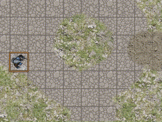
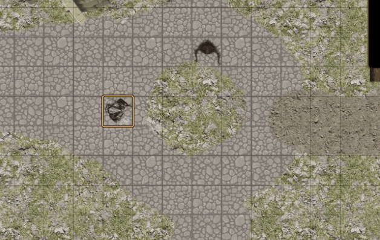
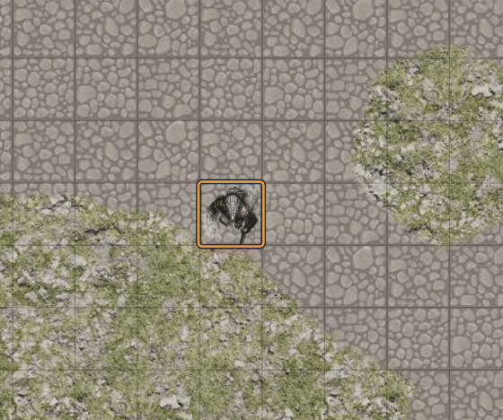
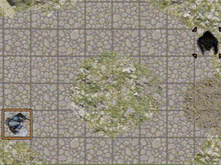
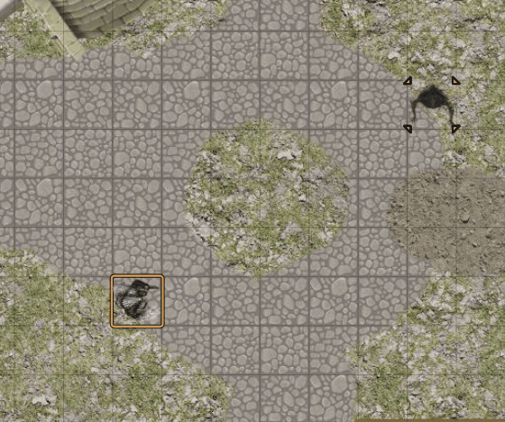
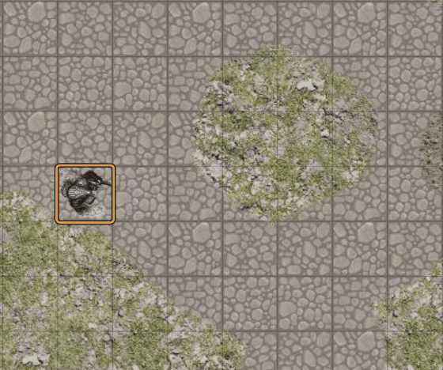

# foundryVTT-particles FX

The module contains several methods to generate particles without needing premade video files. The particles are simple sprite textures managed by script. You can use or add some prefill templates for the emitter or customize it with a JSON input.


*particlesFx.sprayParticles('breath', {source: token.id, target: target.id})*

## What's New
- **v2.1.0**: We added advanced mode to link multiple inputs together and change static values with dynamic functions.
- **v2.2.0**: We added automatic emission settings. Particles can be generated on item usage (Only existing on DnD 5e).
- **v2.3.0**: 
  - We added elevation to particles.
  - We improved the particle texture.
  - We migrated to Foundry v12 (mandatory) and dnd5e v4 (optional).
- **v2.4.0**: 
  - Choose from multiple particle shapes: circle (default and legacy), tor, star, and diamond.
  - Properties next on customize input to link multiple emissions in a workflow.
  - Add flash prefill motion template.
  - Add property `freezeOnPause` to handle game pause in customized inputs.
- **v2.5.0**: 
  - Missile can follow a path through multiple targets. It can be a linear or curved path.
  - Allow calling emission with multiple prefill templates at once.
  - Emission can be triggered for multiple targets with `-m` or `--multiple`.
  - Add description to chat command with `-h` or `-help` like `/pfx spray -h`.

## Settings
1. Avoid showing particles from other clients (useful for minimal configuration) (Client setting)
2. Save emitters when changing scenes and retrieve them when returning (World setting)
3. Define minimal user role to manage custom prefill templates (World setting)
4. Automatically generate emission when using items (Client setting) (Only existing on DnD 5e)
5. Activate elevation management for particles (useful for minimal configuration) (Client setting)
6. Elevation to double the size of a particle in grid number (World setting)

## Emission Methods
The emission methods are used to interpret the input and manage the particles during their lifetime. The method returns its ID.

### Spray Particles
Spray particles are emitted from a source and move with a velocity in a direction defined by an angle.



### Gravitating Particles
Gravitating particles turn around the source with a velocity at a distance defined by a radius.



### Missile Particles
The missile method emits spray particles that are used to emit sub-particles.



### Stop All Emissions
To stop all emissions in the scene and reset the particle emitter's IDs index.

### Stop a Specific Emission
To stop a specific emission, you need to use a macro to call the method `particlesFx.stopEmissionById` with an ID parameter:
- ID of the emission (returned by the method)
- 'l' or 'last' for newest emission
- 'f' or 'first' for oldest emission
And a boolean parameter, `true` for instant deletion of particles already emitted, `false` to stop only the emission (living particles are not killed).

### Stop Workflows
To stop a future emission linked by a workflow to a current one, you need to use a macro to call the method `particlesFx.stopWorkflow(id, isImmediate, all)`
- `id` with an ID parameter:
  - ID of the emission (returned by the method)
  - 'l' or 'last' for newest emission
  - 'f' or 'first' for oldest emission
- `isImmediate` is a boolean parameter: `true` for instant deletion of emitters already generated, `false` to stop/disable only workflows that have not yet begun.
- `all` is a boolean to select workflows in all emitters.

## How to Call It

### Call by Chat
You can start or stop emissions via chat with the command `/pfx`.
It adds a message response in the chat.

Commands:
- `/pfx stopAll (--instant) (--help)`
- `/pfx stopById *id* (--instant) (--help)`
- `/pfx stopWorkflow *id* (--instant) (--all) (--help)`
- `/pfx spray *prefillMotionTemplates* *prefillColorTemplates* *particleShapes* (--multiple) (--help)`
- `/pfx gravitate *prefillMotionTemplates* *prefillColorTemplates* *particleShapes* (--multiple) (--help)`
- `/pfx missile *prefillMotionTemplates* *prefillColorTemplates* *particleShapes* (--curve) (--multiple) (--help)`
- `/pfx help`

```/pfx spray ray death ice```

> To stop a command, you can add the param *--instant* so you do not have to wait for the end of the particles' lifetime.

### Call by Script

- To emit spray particles, you need to use a macro to call the method `particlesFx.sprayParticles(prefillMotionTemplates, prefillColorTemplates, particleShapes, {Advanced options})`
- To emit gravitating particles, you need to use a macro to call the method `particlesFx.gravitateParticles(prefillMotionTemplates, prefillColorTemplates, particleShapes, {Advanced options})`
- To emit missile particles, you need to use a macro to call the method `particlesFx.missileParticles(prefillMotionTemplates, prefillColorTemplates, particleShapes, {Advanced options})`. Advanced options have the same input as Spray particles with a nested object `subParticles` containing another input (spray or gravitating) and type (equals to "Spraying" or "Gravitating").
- Write a message to describe the emitter and a button to stop it: `particlesFx.writeMessageForEmissionById(emitterId, isVerbal)`. The `isVerbal` parameter also writes advanced input in the message.
- To stop all emissions, you need to use a macro to call the method `particlesFx.stopAllEmission(instantDelete)`. `instantDelete` is a boolean parameter: if true, it deletes all particles already emitted; if false, it stops only the emission (living particles are not killed).
- To stop a specific emission, you need to use a macro to call the method `particlesFx.stopEmissionById(id)`. ID is a number or a string:
  - ID of the emission (returned by the method)
  - 'l' or 'last' for the newest emission
  - 'f' or 'first' for the oldest emission
- To stop a future emission linked by a workflow to a current one, you need to use a macro to call the method `particlesFx.stopWorkflow(id, isImmediate, all)`. ID is like the one for `stopEmissionById`, and `all` disables workflows for all current workflows.

> **Example**
> To emit missile particles with gravitating sub-particles that form a trail: 
> `particlesFx.missileParticles({source: {x:200, y:250}, target: token.id, subParticles: {type: "Gravitating", particleLifetime: 1000, onlyEmitterFollow: true, particleAngleStart: '0_360'}})`

#### API Methods

All these methods can also be called with the module's API `game.modules.get("particle-fx").api` with the same parameters and behavior:
- `xxx.api.emit.spray(xxx)`
- `xxx.api.emit.gravit(xxx)`
- `xxx.api.emit.missile(xxx)`
- `xxx.api.emit.writeMessage(xxx)`
- `xxx.api.emit.stopAll(xxx)`
- `xxx.api.emit.stop(xxx)`
- `xxx.api.emit.stopWorkflow(xxx)`

## Prefill Templates

The method emitting particles can be called with multiple prefill templates or none. There are two kinds of templates: **prefillMotionTemplates** and **prefillColorTemplates**, which can be combined. You can add an input to override some attributes of the prefill template. The order of the parameters is not important.

**Prefill Motion Template:**
- explosion (designed for spray)
- breath (designed for spray)
- ray (designed for spray)
- sonar (designed for spray)
- trail (designed for missile)
- wave (designed for missile)
- grow (designed for missile)
- vortex (designed for gravitate)
- aura (designed for gravitate)
- satellite (designed for gravitate)
- slash (designed for gravitate)
- flash (designed for spray (square zone) or gravitate (circle zone))

*Example*
```particlesFx.missileParticles('wave', {source: token.id, target: target.id})```



**Prefill Color Template:**
- ice
- fire
- light
- death
- poison
- silver
- cyber

*Example*
```/pfx spray breath fire```



## Particle Shape
The particle shape property defines the texture of the sprite for each particle.

**Particle shapes:**
- Circle (default)
- Star
- Tor
- Diamond

*Example*
```/pfx spray breath star```


## More Details in the Readme
For more advanced functionality, please read the [WIKI](https://github.com/jdeon/foundryvtt-particles-fx/wiki) for more details:
- More examples of how to use the module
- Add and manage custom prefill templates
- Particular behavior of measured templates as a source
- Customize all the parameters of the emitter to get exactly the animation you want
- Synchronize multiple emitters with workflows

**Example** 
| ```compendium macro Hypnotize
``` | ```compendium macro Concentrate``` |
| :--------------- |:---------------:|
|  |  |
| ```compendium macro firework
``` | ```compendium macro rayball``` |
|  |  |

## V2 Breaking Changes

With v2.0.0, all words containing "particule" have been renamed "particle". Additionally, the object exposing the module's methods (`particleEmitter`) has been renamed `particlesFx`.

Compatibility management has been added with warnings to flag outdated names.

