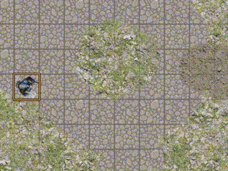
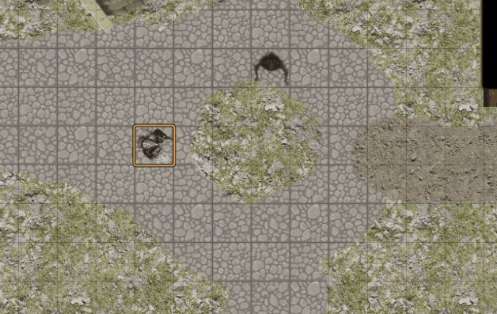
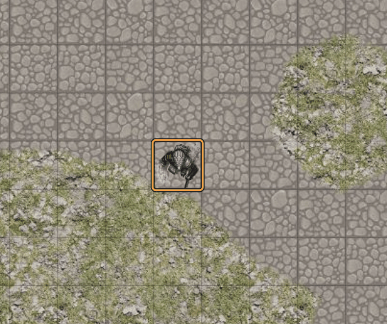
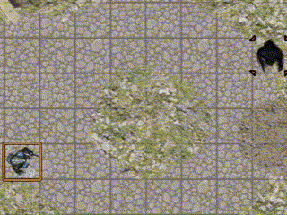
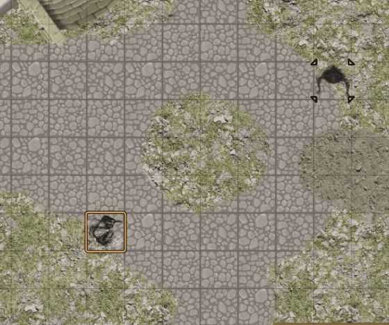
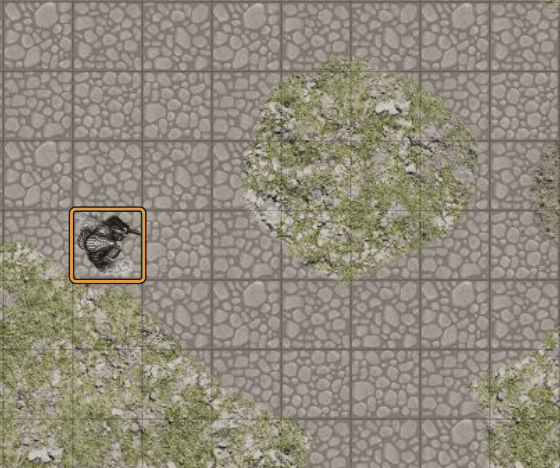

# foundryVTT-particles FX

The module contains several methods to generate particles without needing premade video files. The particles are simple sprite textures managed by script. You can use or add some prefill templates for the emitter or customize it with a JSON input.


*particlesFx.sprayParticles('breath', {source: token.id, target: target.id})*

## What's New
- **v2.1.0**: We added advanced mode to link multiple inputs together and change static values with dynamic functions.
- **v2.2.0**: We added automatic emission settings. Particles can be generated on item usage (Only existing on DnD 5e).
- **v2.3.0**: 
  - We added elevation to particles.
  - We improved the particle texture.
  - We migrated to Foundry v12 (mandatory) and dnd5e v4 (optional).
- **v2.4.0**: 
  - Choose from multiple particle shapes: circle (default and legacy), tor, star, and diamond.
  - Properties next on customize input to link multiple emissions in a workflow.
  - Add flash prefill motion template.
  - Add property `freezeOnPause` to handle game pause in customized inputs.
- **v2.5.0**: 
  - Missile can follow a path through multiple targets. It can be a linear or curved path.
  - Allow calling emission with multiple prefill templates at once.
  - Emission can be triggered for multiple targets with `-m` or `--multiple`.
  - Add description to chat command with `-h` or `-help` like `/pfx spray -h`.
- **v2.6.0**: 
  - Add pf2e system for automatic emission settings on item usage.
- **v2.7.0**: 
  - Foundry VTT v14 compatibility.
  - Added Emitters Manager Panel to monitor, stop and highlight active emissions in real time.
  - Added ability to pause and resume emissions manually (per emitter or globally).
  - Added ability to get emitter query and duplicate it.
  - Improved scene saving and persistence triggers for active emitters.

## Settings
1. Avoid showing particles from other clients (useful for minimal configuration) (Client setting)
2. Save emitters when changing scenes and retrieve them when returning (World setting)
3. Display Emitters Manager Panel on start (World setting)
4. Define minimal user role to manage custom prefill templates (World setting)
5. Automatically generate emission when using items (Client setting) (Supported on DnD 5e & PF2e)
6. Activate elevation management for particles (useful for minimal configuration) (Client setting)
7. Elevation to double the size of a particle in grid number (World setting)

## Emission Methods
The emission methods are used to interpret the input and manage the particles during their lifetime. The method returns its ID.

### Spray Particles
Spray particles are emitted from a source and move with a velocity in a direction defined by an angle.



### Gravitating Particles
Gravitating particles turn around the source with a velocity at a distance defined by a radius.



### Missile Particles
The missile method emits spray particles that are used to emit sub-particles.



### Emitters Manager Panel
Open an interactive GM panel listing all active emitters on the scene with their ID, play/pause status, and live particle count.
- Hover over an emitter item to highlight its position on screen.
- Click an emitter item to copy its ID to the clipboard.
- Pause/Resume, Stop, or Delete emitters directly with single-click action buttons.

### Pause / Resume Emissions
Pause or resume active emissions. Living particles remain rendered on screen while frozen, and particle spawning is suspended until resumed. Can be toggled per emitter or globally across all active emissions.

### Stop All Emissions
To stop all emissions in the scene and reset the particle emitter's IDs index.

### Stop a Specific Emission
To stop a specific emission, you need to use a macro to call the method `particlesFx.stopEmissionById` with an ID parameter:
- ID of the emission (returned by the method)
- 'l' or 'last' for newest emission
- 'f' or 'first' for oldest emission
And a boolean parameter, `true` for instant deletion of particles already emitted, `false` to stop only the emission (living particles are not killed).

### Stop Workflows
To stop a future emission linked by a workflow to a current one, you need to use a macro to call the method `particlesFx.stopWorkflow(id, isImmediate, all)`
- `id` with an ID parameter:
  - ID of the emission (returned by the method)
  - 'l' or 'last' for newest emission
  - 'f' or 'first' for oldest emission
- `isImmediate` is a boolean parameter: `true` for instant deletion of emitters already generated, `false` to stop/disable only workflows that have not yet begun.
- `all` is a boolean to select workflows in all emitters.

### Duplicate an Emission
Duplicate an existing emitter (by ID, 'l', or 'f') using the currently selected token/target, with optional parameter overrides.

### Retrieve Emission Query
Retrieve the active JSON query configuration of any emitter (merged or unmerged original input) by ID for macro creation or debugging.

## How to Call It

### Call by Chat
You call some methods using the prefix `/pfx` in a chat message.
It adds a message response in the chat with id of the generated (or deleted) emission.

Here is the list of all the commands (except the prefix and the first word, all the following words are optional commands):
- `/pfx manage`
- `/pfx pause *id* --all --resume`
- `/pfx stopAll --instant`
- `/pfx stopById *id* --instant`
- `/pfx stopWorkflow *id* --instant --all`
- `/pfx pause *id* --all --resume`
- `/pfx spray *prefillMotionTemplates* *prefillColorTemplates* *particleShapes* --multiple`
- `/pfx gravitate *prefillMotionTemplates* *prefillColorTemplates* *particleShapes* --multiple`
- `/pfx missile *prefillMotionTemplates* *prefillColorTemplates* *particleShapes* --multiple --curve`
- `/pfx query *id* --original`
- `/pfx duplicate *id*`
- `/pfx help`

```/pfx spray ray death ice```

> The parameters "prefillXXXTemplates" are optional, if it is not given, we are using the default prefill. You can choose multiple templates (to mix color for example)<br>
> The parameter "particleShapes" is optional, it must be circle (default), diamond, tor or star. You can choose multiple shapes [More details](https://github.com/jdeon/foundryvtt-particles-fx/wiki/Customize-input-options#particle-shape)<br>
> The parameter "--instant" (`-i`) is optional; if used on a stop command, deletes active particles immediately without waiting for lifetime end.<br>
> The parameter "--multiple" (`-m`) allows you to generate an emission for each targeted token.<br>
> The parameter "--curve" (`-c`) makes missile trajectories follow a curved path between targets.<br>
> The parameter "--original" (`-o`) on query retrieves the raw original input before prefill merging.<br>
> The parameter "--all" (`-a`) on pause target all active emitters.<br>
> The parameter "--resume" (`-r` / `--unpause`) on pause resumes paused emitters.<br>
> All commands accept `--help` (`-h`) to view detailed options and usage.

### Call by Script

- To emit spray particles: `particlesFx.sprayParticles(prefillMotionTemplates, prefillColorTemplates, particleShapes, {Advanced options})`
- To emit gravitating particles: `particlesFx.gravitateParticles(prefillMotionTemplates, prefillColorTemplates, particleShapes, {Advanced options})`
- To emit missile particles: `particlesFx.missileParticles(prefillMotionTemplates, prefillColorTemplates, particleShapes, {Advanced options})`. Advanced options have the same input as Spray particles with a nested object `subParticles` containing another input (spray or gravitating) and type (equals to "Spraying" or "Gravitating").
- Open Emitters Manager Panel: `particlesFx.showEmittersPanel()`
- Refresh Emitters Manager Panel: `particlesFx.refreshEmittersPanel()`
- Toggle pause/resume on an emission: `particlesFx.togglePauseEmissionById(id, isPaused)`
- Pause or resume all emissions: `particlesFx.pauseAllEmission(isPaused)`
- Stop all emissions: `particlesFx.stopAllEmission(instantDelete)`. `instantDelete` is a boolean parameter: if true, it deletes all particles already emitted; if false, it stops only the emission (living particles are not killed).
- Stop a specific emission: `particlesFx.stopEmissionById(id, immediate)`. ID is a number or a string ('l'/'last', 'f'/'first').
- Stop a workflow: `particlesFx.stopWorkflow(id, isImmediate, all)`.
- Write a message describing the emitter with a stop button: `particlesFx.writeMessageForEmissionById(emitterId, isVerbal)`.
- Manage custom templates:
  - `particlesFx.addCustomPrefillMotionTemplate(key, template)`
  - `particlesFx.removeCustomPrefillMotionTemplate(key)`
  - `particlesFx.getCustomPrefillMotionTemplate(key)`
  - `particlesFx.addCustomPrefillColorTemplate(key, template)`
  - `particlesFx.removeCustomPrefillColorTemplate(key)`
  - `particlesFx.getCustomPrefillColorTemplate(key)`

> **Example**
> To emit missile particles with gravitating sub-particles that form a trail: 
> `particlesFx.missileParticles({source: {x:200, y:250}, target: token.id, subParticles: {type: "Gravitating", particleLifetime: 1000, onlyEmitterFollow: true, particleAngleStart: '0_360'}})`

#### API Methods

All these methods can also be called via the module API `game.modules.get("particule-fx").api`:
- **Emission API (`api.emit`)**:
  - `xxx.api.emit.spray(...)`
  - `xxx.api.emit.gravit(...)`
  - `xxx.api.emit.missile(...)`
  - `xxx.api.emit.stop(id, immediate)`
  - `xxx.api.emit.stopAll(immediate)`
  - `xxx.api.emit.stopWorkflow(id, immediate, all)`
  - `xxx.api.emit.togglePause(id, isPaused)`
  - `xxx.api.emit.pauseAll(isPaused)`
  - `xxx.api.emit.duplicate(emitterId, overrides)`
  - `xxx.api.emit.getQuery(emitterId, isOriginal)`
  - `xxx.api.emit.showManagerPanel()`
  - `xxx.api.emit.refreshManagerPanel()`
  - `xxx.api.emit.writeMessage(emitterId, isVerbal)`
- **Custom Prefill Template API (`api.template`)**:
  - `xxx.api.template.motion.add(key, template)`
  - `xxx.api.template.motion.remove(key)`
  - `xxx.api.template.motion.get(key)`
  - `xxx.api.template.color.add(key, template)`
  - `xxx.api.template.color.remove(key)`
  - `xxx.api.template.color.get(key)`

## Prefill Templates

The method emitting particles can be called with multiple prefill templates or none. There are two kinds of templates: **prefillMotionTemplates** and **prefillColorTemplates**, which can be combined. You can add an input to override some attributes of the prefill template. The order of the parameters is not important.

**Prefill Motion Template:**
- explosion (designed for spray)
- breath (designed for spray)
- ray (designed for spray)
- sonar (designed for spray)
- trail (designed for missile)
- wave (designed for missile)
- grow (designed for missile)
- vortex (designed for gravitate)
- aura (designed for gravitate)
- satellite (designed for gravitate)
- slash (designed for gravitate)
- atom (designed for gravitate)
- flash (designed for spray (square zone) or gravitate (circle zone))

*Example*
```particlesFx.missileParticles('wave', {source: token.id, target: target.id})```



**Prefill Color Template:**
- ice
- fire
- light
- death
- poison
- silver
- cyber
- charm

*Example*
```/pfx spray breath fire```



## Particle Shape
The particle shape property defines the texture of the sprite for each particle.

**Particle shapes:**
- Circle (default)
- Star
- Tor
- Diamond

*Example*
```/pfx spray breath star```


## More Details in the Readme
For more advanced functionality, please read the [WIKI](https://github.com/jdeon/foundryvtt-particles-fx/wiki) for more details:
- More examples of how to use the module
- Add and manage custom prefill templates
- Particular behavior of measured templates as a source
- Customize all the parameters of the emitter to get exactly the animation you want
- Synchronize multiple emitters with workflows

**Example** 
| ```compendium macro Hypnotize
``` | ```compendium macro Concentrate``` |
| :--------------- |:---------------:|
|  |  |
| ```compendium macro firework
``` | ```compendium macro rayball``` |
|  |  |

## V2 Breaking Changes

With v2.0.0, all words containing "particule" have been renamed "particle". Additionally, the object exposing the module's methods (`particleEmitter`) has been renamed `particlesFx`.

Compatibility management has been added with warnings to flag outdated names.


