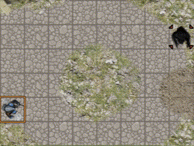

# foundryVTT-particles FX

The module contains several methods to generate particles without needing premade video files. The particles are simples sprites textures managed by script, you can use or add some prefill templates for the emitter or customize it with a json input.

<br>

## Settings
1. Avoid showing particle from other client (useful for minimal configuration) (Client setting)
2. Save emitters when changing scene and retrieve when returning (World setting)
3. Define minimal user role to manage the custom prefill templates (World setting)

<br>

## Emission methods
The emission methods is used to interpret the input and manage the particles during their lifetime.
The method returns its id.


### Spray particles
The spray particles are emitted from a source and move with a velocity in a direction define by an angle.


### Graviting particles
The graviting particles turn around the source with a velocity at a distance defined by a radius.


### Missile particles
The missile method emits a spray particles that is used to emit sub particles.


### Stop all emissions
To stop all emissions in the scene and reset the particle emitters ids index.


### Stop a specific emission
To stop a specific emission, you need to use a macro to call the method ```particlesFx.stopEmissionById``` with an id parameter :
* id of the emission (returned by the method)
* 'l' or 'last' for newest emission
* 'f' or 'first' for oldest emission

And a boolean parameter, true for instant delete of particles already emitted, false to stop only the emission (living particles are not killed).

<br>

## How to call it

### Call by chat
You can start or stop emission by chat with command "/pfx".
It adds a message response in the chat.

Commands :
* /pfx stopAll
* /pfx stopById *id* 
* /pfx spray *prefillMotionTemplate* *prefillColorTemplate*
* /pfx gravitate *prefillMotionTemplate* *prefillColorTemplate*
* /pfx missile *prefillMotionTemplate* *prefillColorTemplate*
* /pfx help

```/pfx spray ray death```

> To stop a command, you can add the param *--instant* to not have to wait the end of the particles lifetime.

### Call by script
* To emit spray particles, you need to use a macro to call the method ```particlesFx.sprayParticles(prefillMotionTemplateName, prefillColorTemplate, {Advanced options})``` 
* To emit graviting particles, you need to use a macro to call the method ```particlesFx.gravitateParticles(prefillMotionTemplateName, prefillColorTemplate, {Advanced options})``` 
* To emit missile particles, you need to use a macro to call the method ```particlesFx.missileParticles(prefillMotionTemplateName, prefillColorTemplate, {Advanced options})```.  Advanced options has the same input as Spray particles with a nested object ```subParticles``` containing another input (spray or graviting) and type (equals to "Spraying" or "Graviting").
* Write a message to describe the emitter and a button to stop it ```particlesFx.writeMessageForEmissionById(emitterId, isVerbal)```. isVerbal parameter also write advanced input in the message
* To stop all emissions, you need to use a macro to call the method ```particlesFx.stopAllEmission(instantDelete)```.  instantDelete is a boolean parameter, if true, it delete all particles already emitted, false to stop only the emission (living particles are not killed).
* To stop a specific emission, you need to use a macro to call the method ```particlesFx.stopEmissionById(id)```. Id is a number or a string :
  * id of the emission (returned by the method)
  * 'l' or 'last' for newest emission
  * 'f' or 'first' for oldest emission

> **Example**
> To emit a missile particles with graviting sub particles that forming a trail 
> ```particlesFx.missileParticles({source : {x:200, y:250} , target: token.id, subParticles : { type: "Graviting", particleLifetime: 1000, onlyEmitterFollow : true, particleAngleStart: '0_360'}})```

#### Apis methods
All this methods can also be calls with the modules API 'game.modules.get("particule-fx").api' with the same parameters and behaviour:
* xxx.api.emit.spray(xxx)
* xxx.api.emit.gravit(xxx)
* xxx.api.emit.missile(xxx)
* xxx.api.emit.writeMessage(xxx)
* xxx.api.emit.stopAll(xxx)
* xxx.api.emit.stop(xxx)


<br>

## Prefill template
The method emitting particles can be called with a prefill template. They are two kinds of template **prefillMotionTemplate** and **prefillColorTemplate** which can be combined. You can add an input to override some attributes of the prefill template.
The order of the paramater is not important, for example ```particlesFx.sprayParticles('prefillMotionTemplate', 'prefillColorTemplate', {position: {x:100, y:'50_100'}})``` is the same as ```particlesFx.sprayParticles('prefillColorTemplate', {position: {x:100, y:'50_100'}}, 'prefillMotionTemplate')```

### Prefill motion template :
**explosion (designed for spray)**
<br><br>

*particlesFx.sprayParticles('explosion', {source :tokenId} )*<br>
<br>

**breath (designed for spray)**
<br><br>
*particlesFx.sprayParticles('breath', {source :token.id, target: target.id} )*<br>
<br>

**ray (designed for spray)**
<br><br>
*particlesFx.sprayParticles('ray', {source :token.id, target: target.id} )*<br>
<br>

**sonar (designed for spray)**
<br><br>
*particlesFx.sprayParticles('sonar', {source :token.id} )*<br>
<br>

**trail (designed for missile)**
<br><br>
*particlesFx.missileParticles('trail', {source :token.id, target: target.id} )*<br>
<br>

**wave (designed for missile)**
<br><br>
*particlesFx.missileParticles('wave', {source :token.id, target: target.id} )*<br>
<br>

**grow (designed for missile)**
<br><br>
*particlesFx.missileParticles('grow', {source :token.id, target: target.id} )*<br>
<br>

**vortex (designed for gravitate)**
<br><br>
*particlesFx.gravitateParticles('vortex', {source :tokenId} )*<br>
<br>

**aura (designed for gravitate)**
<br><br>
*particlesFx.gravitateParticles('aura', {source :tokenId} )*<br>
<br>

**satellite (designed for gravitate)**
<br><br>
*particlesFx.gravitateParticles('satellite', {source :tokenId} )*<br>
<br>

**slash (designed for gravitate)**
<br><br>
*particlesFx.gravitateParticles('slash', {source :tokenId} )*<br>
<br>


### Existing color template :
**ice**
<br><br>
*particlesFx.sprayParticles('breath', 'ice' )*<br>
<br>

**fire**
<br><br>
*particlesFx.sprayParticles('breath', 'fire' )*<br>
<br>

**light**
<br><br>
*particlesFx.sprayParticles('breath', 'light' )*<br>
<br>

**death**
<br><br>
*particlesFx.sprayParticles('breath', 'death' )*<br>
<br>

**poison**
<br><br>
*particlesFx.sprayParticles('breath', 'poison' )*<br>
<br>

**silver**
<br><br>
*particlesFx.sprayParticles('breath', 'silver' )*<br>
<br>

**cyber**
<br><br>
*particlesFx.sprayParticles('breath', 'cyber' )*<br>
<br>

### Added custom prefill template
You can add some custom prefill template (motion or color) using the methods : ```particlesFx.addCustomPrefillMotionTemplate(key, {Advanced options})``` or ```particlesFx.addCustomPrefillColorTemplate(key, {Advanced options})```
If a key is an same of an existing one it replace it.
You need a minimal role to add custom prefill template define in the setting.

You can also delete custom prefill template (motion or color) using the methods : ```particlesFx.removeCustomPrefillMotionTemplate(key)``` or ```particlesFx.removeCustomPrefillColorTemplate(key)```. 

You the custom prefill template already added using the methods : ```particlesFx.getCustomPrefillMotionTemplate(key)``` or ```particlesFx.addCustomPrefillColorTemplate(key)```. If the key is not defined, it retrun all the custom prefill template already created.

#### Apis methods
All this methods can also be calls with the modules API 'game.modules.get("particule-fx").api' with the same parameters and behaviour:
* xxx.api.template.motion.add(xxx)
* xxx.api.template.color.add(xxx)
* xxx.api.template.motion.remove(xxx)
* xxx.api.template.color.remove(xxx)
* xxx.api.template.motion.get(xxx)
* xxx.api.template.color.get(xxx)

## Measured template source
If the source is a measured template, it will override some input properties (like angle) to match with the measured tools. For each measured template type, it works differently depending on the average velocity value :
| Measured template type | Positive velocity | Null velocity | Negative Velocity |
| :--------------- |:---------------:| :----------:| :------------:|
| Circle | Emit from the center to the outside of the circle | Emit from the outside to the center of the circle | Appear everywhere in the circle | 
| Cone | Emit from the center to the outside of the cone | Emit from the outside to the center of the cone | Appear every where in the cone | 
| Rectangle | Emit from the center to the outside of the rectangle | Emit from the outside to the center of the rectangle | Appear every where in the rectangle | 
| Ray | Emit from the source to the opposite of the ray | Emit from the sopposite to the source of the ray | Appear every where in the ray | 

<br>

## Advanced options

The advanced options is a json object to customize the emitters. If one parameter is not define in the input, the script take the default value.

### Input Default Parameters
The input is a json file with the following paramaters. If the parameter is not define in the input, the script take the default value.
This are all the parameters possible to use.
> Notice that if the value XXXend is not given, but the value XXXstart is given, the start value overrides the default end value.

| Parameter name  | accepted value          |  Description          | Default value |
| :--------------- |:---------------:|:---------------:| -----:|
|        source                    |             Placeable object id or an object with x and y attributes with default pattern inside   | Source of the emission if it's a placeable object id, the source is the center of the object and it follow the object  |  {x:0,y:0}  |
|        maxParticles             |   Number                | Max particles allow at the same time for the emitter, if exceed we waiting for a particle to end before emitting another one               |   1000         |
|        spawningFrequence         |   Number                | Frequence between each emission                                |    3          |
|        spawningNumber            |   Number                | Number of particles emit at during each frequence              |    1          |
|        emissionDuration          |   Number                | End particles emission at the end of the duration              |   loop infinitely if undefined       |
|        particleVelocityStart    |   Default pattern       | Velocity of the particle at the spawning (in px/sec)          |   200%        |
|        particleVelocityEnd      |   Default pattern       | Velocity of the particle at his end (in px/sec)               |   50%         |
|        particleSizeStart        |   Default pattern of number or object with x and y | Size of the particle at the spawning (in px)       |   10          |
|        particleSizeEnd          |   Default pattern of number or object with x and y | Size of the particle at his end (in px)            |   '10_25'     |
|        particleRotationStart    |   Default pattern       | Rotation of the particle at the spawning (in degree)          |   0           |
|        particleRotationEnd      |   Default pattern       | Rotation of the particle at his end (in degree)               |   0           |
|        particleLifetime         |   Default pattern       | Duration of each particle (in millisec)                       |  [3500,4500]  |
|        particleColorStart       |   Object with x, y and z attributes with default pattern between 0 and 255               | Color of the particle at the spawning (in rgb (0 to 255))                |   {x:250,y:250, z: 50}      |
|        particleColorEnd         |   Object with x, y and z attributes with default pattern between 0 and 255               | Color of the particle at his end (in rgb (0 to 255))                    |   {x:250,y:'50_100', z: 0}  |
|        alphaStart                |   Default pattern between 0 and 1   | Alpha color of the particle at the spawning       |   1           |
|        alphaEnd                  |   Default pattern between 0 and 1   | Alpha color of the particle at his end            |   0           |
|        vibrationAmplitudeStart   |   Default pattern between 0 and 1   | Amplitude of vibration in perpendicular direction of velocity at the spawning (in px)                                |   0           |
|        vibrationAmplitudeEnd     |   Default pattern between 0 and 1   | Amplitude of vibration in perpendicular direction of velocity at his end (in px)                                |   0           |
|        vibrationFrequencyStart   |   Default pattern between 0 and 1   | Frequence of vibration in perpendicular direction of velocity at the spawning (in milli-sec)                         |   0           |
|        vibrationFrequencyEnd     |   Default pattern between 0 and 1   | Frequence of vibration in perpendicular direction of velocity at his end (in milli-sec)                         |   0           |


### Spraying emission
| Parameter name  | accepted value          |  Description          | Default value |
| :--------------- |:---------------:|:---------------:| -----:|
|  target               |  Placeable object id or an object with x and y attributes with default pattern inside | The target of the emission, it use to change the angle of the direction and prolonge lifetime of the particles     |    undefined         |
|  positionSpawning     |  Object with x and y attributes with default pattern inside  | Gap coordinate between source and the real position spawning of the particle (in px)                 |  {x:0,y:0}        |
|  particleAngleStart  |  Default pattern  | Direction of the particle at the spawning (in degree)    |   '0_360'     |
|  particleAngleEnd    |  Default pattern  | Direction of the particle at his end (in degree)         |   undefined   |

> **Example**
> To emit particles from a choosen tile direct to a specific token with a constant velocity of 100 px/s
> ```particlesFx.sprayParticles({source :tile.id, target: token.id , particleVelocityStart : 100, particleAngleStart : 0})```


### Graviting particles
> In this method the particleVelocityStart and the particleVelocityEnd are angular velocities (degree/sec)

| Parameter name  | accepted value          |  Description          | Default value |
| :--------------- |:---------------:|:---------------:| -----:|
|  particleAngleStart  |  Default pattern  | Angle where the particle spawn (in degree)                                        |   '0_360'     |
|  particleRadiusStart |  Default pattern  | Distance between particle and source at the spawning (in px)                      |   '100%'      |
|  particleRadiusEnd   |  Default pattern  | Distance between particle and source at his end (in px)                           |   '50%'       |
|  onlyEmitterFollow    |  boolean          | If true only new particle is emit from the new position of the source if it move  |   false       |

> **Example**
> To emit particles graviting around a choosen token and ending at his center. The living particles will not move with the token 
> ```particlesFx.gravitateParticles({source : token.id , particleRadiusStart : '200%', particleRadiusEnd : 5, onlyEmitterFollow : true})```


### Default pattern
For the majority of the parameters you can use multiple patterns :
* Number (ex:9)                   : The direct value
* String (ex:'9')                 : The value converted to Number
* Percent (ex:'9%')               : The value multiplied by the grid pixel (ex: if grid size is 50px, '10%' become 5px )
* Undescored String (ex:'9_14')   : A random value between the two inclusive boundaries, percent accepted (ex: '10%_30%')
* Array  (ex:[9,8,12])            : A random value of the array, the value can be a any of the default pattern (ex: [9,'8','12_15'])
