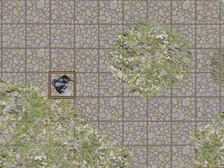
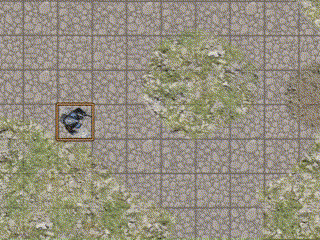

# foundryVTT-particule FX

The module contains several methods to generate particules using a json input. The particules are simples sprites textures managed by script, no need of video files.

Note that neither the emitter neither the particules are persisted. If you reload the page or change the scene it disappears.


## Emission methods by script
The emission method is used to interpret the input and manage the particules during their lifetime.
The method returns its id.


### Spray particule
The spray particule is emitted from a source and move with a velocity in a direction define by an angle.


To emit spray particules, you need to use a macro to call the method ```particuleEmitter.sprayParticules``` with an input that contains the default parameters and following ones :

| Parameter name  | accepted value          |  Description          | Default value |
| :--------------- |:---------------:|:---------------:| -----:|
|  target               |  Placeable object id or an object with x and y attributes with default pattern inside | The target of the emission, it use to change the angle of the direction and prolonge lifetime of the particules     |    undefined         |
|  positionSpawning     |  Object with x and y attributes with default pattern inside  | Gap coordinate between source and the real position spawning of the particule (in px)                 |  {x:0,y:0}        |
|  particuleAngleStart  |  Default pattern  | Direction of the particule at the spawning (in degree)    |   '0_360'     |
|  particuleAngleEnd    |  Default pattern  | Direction of the particule at his end (in degree)         |   undefined   |

> **Example**
> To emit particules from a choosen tile direct to a specific token with a constant velocity of 100 px/s
> ```particuleEmitter.sprayParticules({source :tile.id, target: token.id , particuleVelocityStart : 100, particuleAngleStart : 0})```


### Graviting particule
The graviting particule turn around the source with a velocity at a distance defined by a radius.


To emit graviting particules, you need to use a macro to call the method ```particuleEmitter.gravitateParticules``` with an input that contains the default parameters and following ones :

> In this method the particuleVelocityStart and the particuleVelocityEnd are angular velocities (degree/sec)

| Parameter name  | accepted value          |  Description          | Default value |
| :--------------- |:---------------:|:---------------:| -----:|
|  particuleAngleStart  |  Default pattern  | Angle where the particule spawn (in degree)                                        |   '0_360'     |
|  particuleRadiusStart |  Default pattern  | Distance between particule and source at the spawning (in px)                      |   '100%'      |
|  particuleRadiusEnd   |  Default pattern  | Distance between particule and source at his end (in px)                           |   '50%'       |
|  onlyEmitterFollow    |  boolean          | If true only new particule is emit from the new position of the source if it move  |   false       |

> **Example**
> To emit particules graviting around a choosen token and ending at his center. The living particules will not move with the token 
> ```particuleEmitter.gravitateParticules({source : token.id , particuleRadiusStart : '200%', particuleRadiusEnd : 5, onlyEmitterFollow : true})```

### Missile particule
The missile method emits a spray particule that is used to emit sub particules.


To emit missile particules, you need to use a macro to call the method ```particuleEmitter.missileParticules``` with a same input as Spray particule with a nested object ```subParticules``` containing another input (spray or graviting) and type (equals to "Spraying" or "Graviting").

> **Example**
> To emit a missile particule with graviting sub particules that forming a trail 
> ```particuleEmitter.missileParticules({source : {x:200, y:250} , target: token.id, subParticules : { type: "Graviting", particuleLifetime: 1000, onlyEmitterFollow : true, particuleAngleStart: '0_360'}})```


## Input Default Parameters
The input is a json file with the following paramaters. If the parameter is not define in the input, the script take the default value.
This are all the parameters possible to use.
> Notice that if the value XXXend is not given, but the value XXXstart is given, the start value overrides the default end value.

| Parameter name  | accepted value          |  Description          | Default value |
| :--------------- |:---------------:|:---------------:| -----:|
|        source                    |             Placeable object id or an object with x and y attributes with default pattern inside   | Source of the emission if it's a placeable object id, the source is the center of the object and it follow the object  |  {x:0,y:0}  |
|        maxParticules             |   Number                | Max particule allow at the same time for the emitter, if exceed we waiting for a particule to end before emitting another one               |   1000         |
|        spawningFrequence         |   Number                | Frequence between each emission                                |    3          |
|        spawningNumber            |   Number                | Number of particule emit at during each frequence              |    1          |
|        emissionDuration          |   Number                | End particule emission at the end of the duration              |   loop infinitely if undefined       |
|        particuleVelocityStart    |   Default pattern       | Velocity of the particule at the spawning (in px/sec)          |   200%        |
|        particuleVelocityEnd      |   Default pattern       | Velocity of the particule at his end (in px/sec)               |   50%         |
|        particuleSizeStart        |   Default pattern of number or object with x and y | Size of the particule at the spawning (in px)       |   10          |
|        particuleSizeEnd          |   Default pattern of number or object with x and y | Size of the particule at his end (in px)            |   '10_25'     |
|        particuleRotationStart    |   Default pattern       | Rotation of the particule at the spawning (in degree)          |   0           |
|        particuleRotationEnd      |   Default pattern       | Rotation of the particule at his end (in degree)               |   0           |
|        particuleLifetime         |   Default pattern       | Duration of each particule (in millisec)                       |  [3500,4500]  |
|        particuleColorStart       |   Object with x, y and z attributes with default pattern between 0 and 255               | Color of the particule at the spawning (in rgb (0 to 255))                |   {x:250,y:250, z: 50}      |
|        particuleColorEnd         |   Object with x, y and z attributes with default pattern between 0 and 255               | Color of the particule at his end (in rgb (0 to 255))                    |   {x:250,y:'50_100', z: 0}  |
|        alphaStart                |   Default pattern between 0 and 1   | Alpha color of the particule at the spawning       |   1           |
|        alphaEnd                  |   Default pattern between 0 and 1   | Alpha color of the particule at his end            |   0           |
|        vibrationAmplitudeStart   |   Default pattern between 0 and 1   | Amplitude of vibration in perpendicular direction of velocity at the spawning (in px)                                |   0           |
|        vibrationAmplitudeEnd     |   Default pattern between 0 and 1   | Amplitude of vibration in perpendicular direction of velocity at his end (in px)                                |   0           |
|        vibrationFrequencyStart   |   Default pattern between 0 and 1   | Frequence of vibration in perpendicular direction of velocity at the spawning (in milli-sec)                         |   0           |
|        vibrationFrequencyEnd     |   Default pattern between 0 and 1   | Frequence of vibration in perpendicular direction of velocity at his end (in milli-sec)                         |   0           |


### Default pattern
For the majority of the parameters you can use multiple patterns :
* Number (ex:9)                   : The direct value
* String (ex:'9')                 : The value converted to Number
* Percent (ex:'9%')               : The value multiplied by the grid pixel (ex: if grid size is 50px, '10%' become 5px )
* Undescored String (ex:'9_14')   : A random value between the two inclusive boundaries, percent accepted (ex: '10%_30%')
* Array  (ex:[9,8,12])            : A random value of the array, the value can be a any of the default pattern (ex: [9,'8','12_15'])


## Stop all emissions
To stop all emissions, you need to use a macro to call the method ```particuleEmitter.stopAllEmission``` with a boolean parameter, true for instant delete of particules already emitted, false to stop only the emission (living particules are not killed).


## Stop a specific emission
To stop a specific emission, you need to use a macro to call the method ```particuleEmitter.stopEmissionById``` with an id parameter :
* id of the emission (returned by the method)
* 'l' or 'last' for newest emission
* 'f' or 'first' for oldest emission

And a boolean parameter, true for instant delete of particules already emitted, false to stop only the emission (living particules are not killed).


## Prefill template
The method emitting particules can be called with a prefill template. They are two kinds of template **prefillMotionTemplate** and **prefillColorTemplate** which can be combined. You can add an input to override some attributes of the prefill template.
The order of the paramater is not important, for example ```particuleEmitter.sprayParticules('prefillMotionTemplate', 'prefillColorTemplate', {position: {x:100, y:'50_100'}})``` is the same as ```particuleEmitter.sprayParticules('prefillColorTemplate', {position: {x:100, y:'50_100'}}, 'prefillMotionTemplate')```

### Prefill motion template :
**explosion (designed for spray)**


*particuleEmitter.sprayParticules('explosion', {source :tokenId} )*
\

**breath (designed for spray)**


*particuleEmitter.sprayParticules('breath', {source :token.id, target: target.id} )*
\

**ray (designed for spray)**


*particuleEmitter.sprayParticules('ray', {source :token.id, target: target.id} )*
\

**sonar (designed for spray)**



*particuleEmitter.sprayParticules('sonar', {source :token.id} )*
\

**trail (designed for missile)**


*particuleEmitter.missileParticules('trail', {source :token.id, target: target.id} )*
\

**wave (designed for missile)**


*particuleEmitter.missileParticules('wave', {source :token.id, target: target.id} )*
\

**grow (designed for missile)**


*particuleEmitter.missileParticules('grow', {source :token.id, target: target.id} )*
\

**vortex (designed for gravitate)**


*particuleEmitter.gravitateParticules('vortex', {source :tokenId} )*
\

**aura (designed for gravitate)**


*particuleEmitter.gravitateParticules('aura', {source :tokenId} )*
\

**satellite (designed for gravitate)**



*particuleEmitter.gravitateParticules('satellite', {source :tokenId} )*
\

**slash (designed for gravitate)**


*particuleEmitter.gravitateParticules('slash', {source :tokenId} )*
\


### Existing color template :
**ice**


*particuleEmitter.sprayParticules('breath', 'ice' )*
\

**fire**


*particuleEmitter.sprayParticules('breath', 'fire' )*
\

**light**


*particuleEmitter.sprayParticules('breath', 'light' )*
\

**death**


*particuleEmitter.sprayParticules('breath', 'death' )*
\

**poison**


*particuleEmitter.sprayParticules('breath', 'poison' )*
\

**silver**


*particuleEmitter.sprayParticules('breath', 'silver' )*
\

**cyber**


*particuleEmitter.sprayParticules('breath', 'cyber' )*
\

## Call by chat
You can start or stop emission by chat with command "/pfx".
It adds a message response in the chat.

Commands :
* /pfx stopAll
* /pfx stopById *id* 
* /pfx spray *prefillMotionTemplate* *prefillColorTemplate*
* /pfx gravitate *prefillMotionTemplate* *prefillColorTemplate*
* /pfx missile *prefillMotionTemplate* *prefillColorTemplate*
* /pfx help

```/pfx spray ray death```

> To stop a command, you can add the param *--instant* to not have to wait the end of the particules lifetime.


## Measured template source
If the source is a measured template, it will override some input properties (like angle) to match with the measured tools. For each measured template type, it works differently depending on the average velocity value :
| Measured template type | Positive velocity | Null velocity | Negative Velocity |
| :--------------- |:---------------:| :----------:| :------------:|
| Circle | Emit from the center to the outside of the circle | Emit from the outside to the center of the circle | Appear everywhere in the circle | 
| Cone | Emit from the center to the outside of the cone | Emit from the outside to the center of the cone | Appear every where in the cone | 
| Rectangle | Emit from the center to the outside of the rectangle | Emit from the outside to the center of the rectangle | Appear every where in the rectangle | 
| Ray | Emit from the source to the opposite of the ray | Emit from the sopposite to the source of the ray | Appear every where in the ray | 
